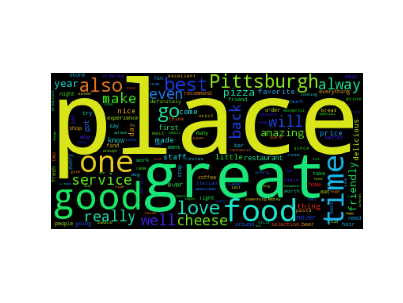

# eatTalkLove
Classification and Analysis of Keywords of Yelp Reviews

## Abstract

With the increasing popularity of Yelp and the huge amount of data it collects, the analysis of users’ reviews has become an essential technique to understand customer behaviors. In this project, we focused on the classification and analysis of keywords of yelp reviews. The Yelp Challenge Dataset, which contains 2.2M reviews made by 552K users, is used in the project. In the first phase of the project, we built an adaboost model to predict the star rating of a review from the corresponding text. The model achieved 91.91% accuracy rate on a test set with 40K+ reviews and generated keywords in the process. In the next phase of the project, we analyzed the keywords in the sense of words frequency, part of speech and positive/negative effects. Through showing the power of the keywords in classifying reviews, this research shows that from 13.18% of the words we can detect 90%+ sentiment in the reviews.
